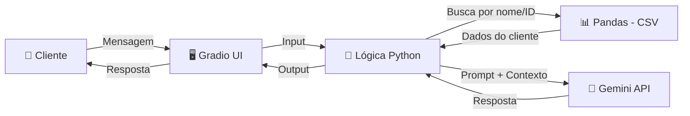

# 🤖 RecuperaBot — Co-Piloto de Renegociação e Retenção com IA


---

## 🎯 O Problema de Negócio

Centrais de atendimento de empresas de telecom, bancos e utilities enfrentam um trio de desafios caros:

| Métrica | Impacto |
|---|---|
| **Inadimplência** | Receita parada no contas a receber, impactando fluxo de caixa |
| **Custo Operacional (TMA)** | Cada minuto de um operador humano negociando custa dinheiro |
| **Churn** | Clientes inadimplentes que não são retidos viram cancelamento definitivo |

A maioria das tentativas de cobrança falha porque são **frias, roteirizadas e constrangedoras**. O cliente desliga. A empresa perde receita e o cliente.

---

## 💡 A Solução

O **RecuperaBot** é um agente conversacional que atua como um co-piloto de negociação, combinando:

- **IA Generativa (Google Gemini)** para conduzir conversas empáticas e naturais, sem scripts robóticos.
- **Regras de negócio parametrizadas** (desconto máximo, parcelamento) para que a IA nunca extrapole a política comercial da empresa.
- **Consulta a dados tabulares (CSV/Pandas)** simulando a integração com um CRM real, onde o bot identifica o cliente e puxa seu histórico de dívida em tempo real.

O resultado: um atendimento que **retém o cliente**, fecha acordos dentro da margem autorizada e reduz drasticamente o TMA.

---

## ⚙️ Arquitetura e Fluxo



**Fluxo detalhado:**

1. O cliente acessa a interface web (Gradio) e inicia a conversa.
2. A IA (persona "Clara") cumprimenta e solicita identificação (nome ou ID).
3. O sistema busca o cliente na base de dados local via Pandas.
4. Os dados encontrados (dívida, atraso, desconto máximo) são injetados no prompt como contexto invisível ao cliente.
5. O Gemini gera a resposta respeitando as regras de negócio configuradas.
6. A negociação segue até o fechamento do acordo ou encerramento.

---

## 📁 Estrutura do Projeto

```
recuperabot/
├── .env.example        # Template de variáveis de ambiente
├── .gitignore          # Arquivos ignorados pelo Git
├── requirements.txt    # Dependências do projeto
├── README.md
├── gerar_dados.py      # Gerador de dados sintéticos (Faker + Pandas)
├── app.py              # Aplicação principal (Gradio + Gemini)
└── data/
    └── inadimplentes.csv   # Base de clientes (gerada automaticamente)
```

---

## 🚀 Como Executar

### Pré-requisitos

- Python 3.12+ instalado (ou [uv](https://docs.astral.sh/uv/) como gerenciador)
- Uma API Key gratuita do [Google AI Studio](https://aistudio.google.com/apikey)

### Passo a passo

**1. Clone o repositório:**

```bash
git clone https://github.com/devgmotta/recuperabot-ai.git
cd recuperabot-ai
```

**2. Instale as dependências:**

```bash
pip install -r requirements.txt
```

> Ou, se estiver usando `uv`:
> ```bash
> uv pip install -r requirements.txt
> ```

**3. Configure a API Key:**

Crie um arquivo `.env` na raiz do projeto com base no template:

```bash
cp .env.example .env
```

Abra o `.env` e substitua o valor pela sua chave:

```
GEMINI_API_KEY=sua_chave_real_aqui
```

**4. Gere a base de dados sintética:**

```bash
python gerar_dados.py
```

Isso criará o arquivo `data/inadimplentes.csv` com 50 clientes fictícios.

**5. Inicie a aplicação:**

```bash
python app.py
```

Acesse no navegador: **http://127.0.0.1:7860**

---

## 🧪 Como Testar

Após iniciar a aplicação, abra o arquivo `data/inadimplentes.csv` e escolha um cliente. No chat:

1. Diga **"Olá"** — a Clara vai cumprimentar e pedir identificação.
2. Digite o **nome completo** ou o **ID** de um cliente do CSV.
3. A IA vai apresentar a dívida e propor o pagamento integral.
4. Diga **"Não tenho como pagar tudo"** — ela oferecerá parcelamento.
5. Insista dizendo **"Não consigo nem parcelado"** — ela aplicará o desconto máximo autorizado.
6. Tente pedir um desconto **maior** do que o permitido — a IA vai negar educadamente.

---

## 🛡️ Segurança e LGPD

- **Zero dados reais.** Toda a base de clientes é gerada sinteticamente com a biblioteca Faker.
- **API Key protegida.** Armazenada em `.env` (incluído no `.gitignore`), nunca exposta no código-fonte.
- **Template público.** O arquivo `.env.example` orienta novos colaboradores sem vazar credenciais.

---

## 👤 Sobre o Autor

Esse projeto nasceu de uma experiência que poucos desenvolvedores têm: a visão da trincheira operacional. Antes de escrever a primeira linha de código, eu já conhecia de perto a rotina de uma central de atendimento — atuei como Operador Jr e Control Desk Jr, lidando diariamente com filas, TMA, retenção e a pressão de manter clientes que estavam prestes a cancelar. Eu sei exatamente onde o processo quebra, porque eu estava lá quando quebrava. Hoje, cursando Análise e Desenvolvimento de Sistemas e Engenharia de Software, estou unindo essa vivência de negócio com as ferramentas certas — Python, IA Generativa e automação — para construir soluções que resolvem problemas reais, não apenas exercícios acadêmicos. O RecuperaBot é a prova de que entender o problema é tão importante quanto saber programar a solução.

---

## 📄 Licença

Este projeto é de uso livre para fins de estudo e portfólio.
